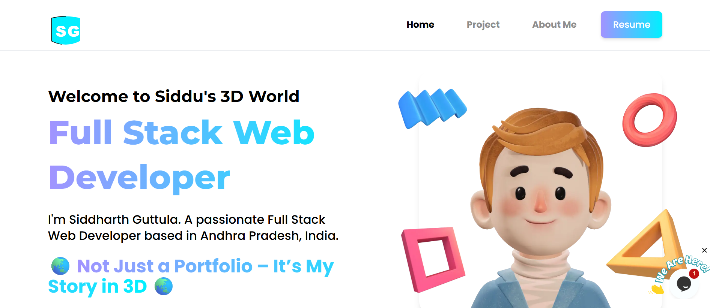

<!--x axis divider-->


<div align="center">

<!-- Banner (replace /assets/images/banner.png with your badminton-court banner) -->


<!-- Badges -->

[](https://wakatime.com/@22520ecf-cee6-4d59-a21f-b5d7f4f8e491)


</div>

<!--x axis divider-->


<picture>
  <a href="assets/images/siddu-s-3D-world.png" alt="Developer">
    
  </a>
</picture>

```js
"use creativity";
import { Person } from "india";

new Person({
  name: "G Siddharth",
  title: "Full Stack Developer",
  email: "guttulasiddharth1109@gmail.com",
  website: "https://siddu-s-3-d-world.vercel.app/",
  junior: !!!false,
}).introduce();
cmd
Copy code
D:\lab\Siddu> node index.js
Hi, my name is G Siddharth, I'm a Junior Full Stack Developer from India.
<!--x axis divider-->


<h3 align="center">✨ My Portfolio Website ✨</h3> <div align="center"> <a href="https://siddu-s-3-d-world.vercel.app/" alt="Siddu's-3D-World">  </a> </div> <!--x axis divider-->


<!--START_SECTION:waka-->
Last Updated on 21-09-2025 17:19:09 UTC

<!--END_SECTION:waka--> <!--x axis divider-->


🧑‍💻 Frequently Used Tech
<p align="center"> <a href="https://skillicons.dev/icons?i=js,php,ts,react,nextjs,tailwindcss,nodejs,express,laravel,mysql,git,vscode,figma,vercel,vite,cloudflare,prisma&perline=6">  </a> </p> <!--x axis divider-->


📊 GitHub Stats
<p align="center">   </p> <p align="center">  </p> <!--x axis divider-->


🤝 Connect with Me
<div align="center">


<br/> <a href="mailto:guttulasiddharth1109@gmail.com">guttulasiddharth1109@gmail.com</a> • <a href="https://siddu-s-3-d-world.vercel.app/">siddu-s-3-d-world.vercel.app</a> </div> <!--x axis divider-->


🐍 GitHub Contribution Snake
<div align="center"> <picture> <source media="(prefers-color-scheme: dark)" srcset="https://raw.githubusercontent.com/Siddu-s-3D-World/Siddu-s-3D-World/output/github-snake-dark.svg" /> <source media="(prefers-color-scheme: light)" srcset="https://raw.githubusercontent.com/Siddu-s-3D-World/Siddu-s-3D-World/output/github-snake.svg" />  </picture> </div> <!--x axis divider-->


<div align="center"> Made with ❤️ by <a href="https://siddu-s-3-d-world.vercel.app/" target="_blank">G Siddharth</a> </div> <!--x axis divider-->